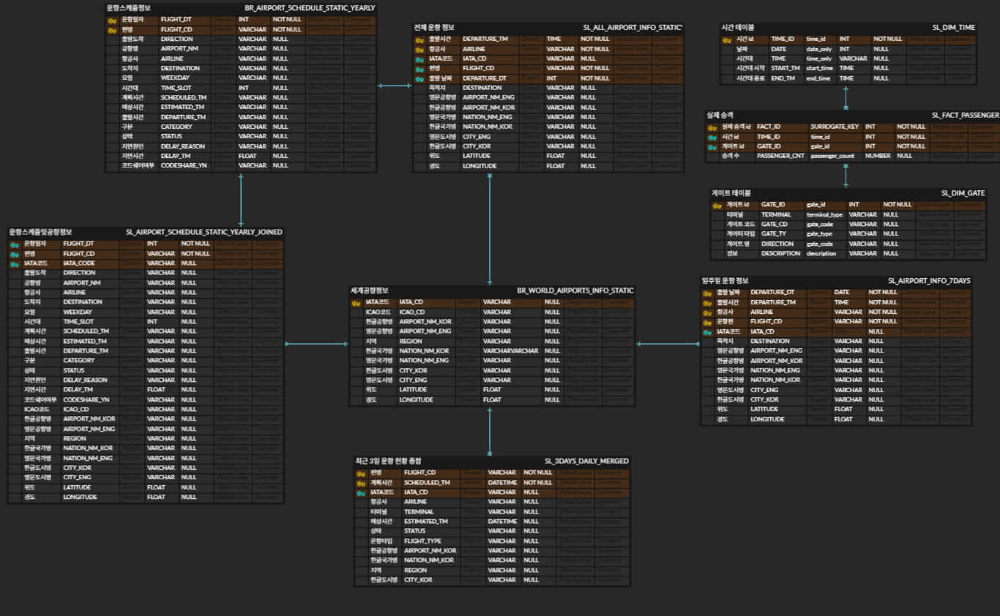
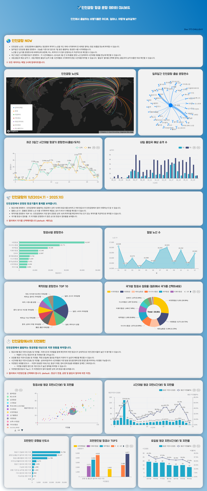

# ✈️ 인천공항 항공기 운항 데이터 대시보드

## 프로젝트 목표
> 인천공항의 항공 데이터를 API와 크롤링을 이용하여 데이터를 수집하고, AWS S3와 Snowflake에 데이터를 적재 및 변환하는 과정을 Airflow를 이용하여 자동화하는 파이프라인을 구축합니다.
> 수집된 데이터를 통해 인천공항의 정보를 Preset을 이용한 대시보드로 시각화하여 제공합니다.

<br>

## 💾 사용 데이터
- [여객 출발 시간표](https://www.airport.kr/ap_ko/869/subview.do) <br>
- [항공사 출발/도착 정보](https://www.airportal.go.kr/airport/aircraftInfo.do) <br>
- [출·입국장별 승객예고](https://www.data.go.kr/data/15095066/openapi.do) <br>
- [인천공항 여객기 운항 현황](https://www.data.go.kr/data/15112968/openapi.do)

<br>

## 📝 프로젝트 구성
### ⚙️ Airflow - Docker 환경 구축하기
[Docker에서 Airflow 환경 구성하기](https://github.com/dahye83/DE7_chillguy/blob/8f278462df3f405894341fbc69137425a64c30a1/docs/docker.md)

### 🧱 아키텍처 구조도
- Data Source -> Data Lake(AWS S3) -> Data Warehouse(Snowflake) -> Visualization(Preset)


### ➡️ DFD


### 🗄️ ERD


### 📁 Github 디렉터리
```src
de7_chillguy/
├── airflow/ 
│   ├── dags/
│   │   ├── ingestion/     # 데이터 수집 DAG
│   │   │   ├──static/     # 변경되지 않는 데이터                
│   │   │   └──dynamic/    # 주기적으로 갱신되는 데이터
│   │   └── elt/           # ELT DAG
│   │
│   └── plugins/           # DAG 공통 모듈
│
├── sql/                   # Snowflake 테이블 생성 쿼리
│
├── data/                  # 사용된 원천 데이터
│   ├── dynamic/
│   └── static/
│
├── docs/
│   ├── image/
│   └── docker.md          # Airflow - Docker 환경설정 설명
│
├── .gitignore
├── docker-compose.yaml
├── Dockerfile
├── requirements.txt
└── README.md
```

### ⏱️ Airflow DAGs


<br>

## 🖥️ 사용 기술
### 🛠️ Data Engineering Toolkit


### 🤝 Collaboration & Management


<br>

## 📊 대시보드 구성

