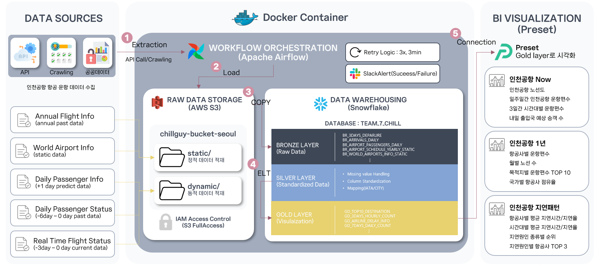
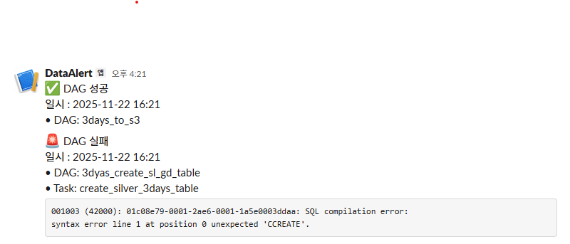

# ✈️ 인천공항 항공기 운항 데이터 대시보드

## 프로젝트 목표
> 인천공항의 항공 데이터를 API와 크롤링을 이용하여 데이터를 수집하고, AWS S3와 Snowflake에 데이터를 적재 및 변환하는 과정을 Airflow를 이용하여 자동화하는 파이프라인을 구축합니다.
> 수집된 데이터를 통해 인천공항의 정보를 Preset을 이용한 대시보드로 시각화하여 제공합니다.

<br>

## 💾 사용 데이터
- [여객 출발 시간표](https://www.airport.kr/ap_ko/869/subview.do) <br>
- [항공사 출발/도착 정보](https://www.airportal.go.kr/airport/aircraftInfo.do) <br>
- [출·입국장별 승객예고](https://www.data.go.kr/data/15095066/openapi.do) <br>
- [인천공항 여객기 운항 현황](https://www.data.go.kr/data/15112968/openapi.do)

<br>

## 📝 프로젝트 구성
### ⚙️ Airflow - Docker 환경 구축하기
[Docker에서 Airflow 환경 구성하기](https://github.com/dahye83/DE7_chillguy/blob/8f278462df3f405894341fbc69137425a64c30a1/docs/docker.md)

### 🧱 아키텍처 구조도
- Data Source -> Data Lake(**AWS S3**) -> Data Warehouse(**Snowflake**) -> Visualization(**Preset**)


### ➡️ 데이터 저장소 구조
- **S3**
```src
chillguy-bucket-seoul/
── dynamic/ # 변경되지 않는 정적 데이터
│   ├── airportschedule_loads3.csv               # 7일간 비행 출발 계획표
│   ├── airportpassengersnum_downloads_daily.csv # 내일 출입국 승객 예보
│   ├── 3days_arrivals_daily.csv                 # 최근 3일간 도착 비행 정보
│   └── 3days_departures_daily.csv               # 최근 3일간 출발 비행 정보
└── static/ # 매일/주기적으로 갱신되는 데이터
│   ├── world_airports_info.csv                  # 세계 공항 정보
└── └── final_airport.csv                        # 연간 운항 정보
```

- **Medallion Architecture (Snowflake)**
```src
TEAM_7_CHILL
│
├── BRONZE      
│       (웹 크롤링/오픈API → S3 → Snowflake)
│       • 3일 운항 정보 Raw(출발, 도착)
│       • 7일 여객 스케줄 Raw
│       • 1년치 여객 스케줄 Raw(24.11~25.11) 
│       • 승객 예고 Raw
│       • 세계 공항 정보 Raw
├── SILVER 
│       (대시보드용 요약 전 단계)     
│       • 3일 운항 정보 통합 테이블 
│       • 7일 여객 스케줄 정제 테이블
│       • 세계 공항 정보 정제 테이블 
│       • 시간/게이트 등의 DIM 테이블
│       • 승객 FACT 테이블 
│
└── GOLD        
│       • 인천공항 노선도, 일주일 인천공항 출발 운항편수
│       • 최근 3일간 항공기 운항편수(출발/도착)
│       • 목적지별 운항편수, 항공사별 노선 수 TOP 
│       • 월별 노선수
│       • 내일 출입국 예상 승객 수
│       • 국가별 항공사 점유율 
│       • 지연 원인수 
│       • 지연 원인별 항공사 탑 3
└──     • 항공사별, 요일별, 시간대별 평균 지연시간(분) 및 지연율
```


### 🗄️ ERD
- ERD는 Snowflake의 **Silver Schema**를 기준으로 작성되었습니다.


### 📁 Github 디렉터리
```src
de7_chillguy/
├── airflow/ 
│   ├── dags/
│   │   ├── ingestion/     # 데이터 수집 DAG
│   │   │   ├──static/          # 변경되지 않는 데이터                
│   │   │   └──dynamic/         # 주기적으로 갱신되는 데이터
│   │   ├── elt/           # ELT DAG
│   │   └── plugins/       # pipeline trigger
│   └── plugins/           # DAG 공통 모듈
├── sql/                   # Snowflake 테이블 생성 쿼리
│   ├── silver/
│   └── gold/
├── data/                  # 사용된 원천 데이터
│   ├── dynamic/                
│   └── static/
├── docs/
│   ├── image/
│   └── docker.md          # Airflow - Docker 환경설정 설명
├── .gitignore
├── docker-compose.yaml
├── Dockerfile
├── requirements.txt
└── README.md
```

### ⏱️ Airflow DAGs
- **ingestion**
    - dynamic
        - 3days_loads3_csv.py: 3일간 운항 현황 데이터 수집, .csv 형식으로 S3에 저장 및 Snowflake 브론즈 테이블 생성
        - airportpassengersnum_downloads_daily.py: 승객 예고 데이터 수집, .csv 형식으로 S3에 저장 및 Snowflake 브론즈 테이블 생성
        - airportschedule_loads3_csv.py: 인천공항 7일간 출발 예정 데이터 수집, .csv 형식으로 S3에 저장
        - airportschedule_loadsnow_csv.py: 인천공항 7일간 출발 예정 데이터 S3에서 로드 후 Snowflake 브론즈 테이블 생성
        - gd_map_airline.py: 인천공항 7일간 출발 예정 데이터 골드 테이블 생성 ### elt로 옮겨
        - sl_airport_info_7days.py: 인천공항 7일간 출발 예정 데이터 실버 테이블 생성 ### elt로 옮겨
    - static
        - airport_schedule_preprocessing.py: 
        - s3_to_snowflake.py: S3에서 Snowflake로 적재하는 태스크 생성
        - upload_csv_to_s3.py: S3에 .csv 파일을 업로드하는 태스크 생성
- **elt**
    - silver_layer_generation.py: 실버 테이블 생성
    - gold_layer_generation.py: 골드 테이블 생성
    - 3days_create_table.py: 3일간 운항 현황 데이터 실버, 골드 테이블 생성
- **plugins**
    - master_airport_pipeline.py: 인천공항 1년 데이터 파이프라인

- 모든 DAG 공통 설정
    ```python
    schedule = '0 5 * * *' # UTC + 9시 스케줄링
    default_args= {'retries': 3,
                   'retry_delay': timedelta(minutes = 3),
                   'on_failure_callback': send_slack_failure_callback}
    on_success_callback= send_slack_success_callback
    ```
    - 14시 스케줄링 설정
    - DAG 실패시 3분 간격으로 3회 재시도 설정  
    - DAG의 성공과 Task의 실패 알림을 슬랙으로 전달
    

<br>

## 🖥️ 사용 기술
### 🛠️ Data Engineering Pipeline Toolkit


### 🤝 Collaboration & Management


<br>

## 📊 대시보드
### 대시보드 구성
1. **인천공항 NOW**
    - **인천공항 노선도**: 인천공항에서 출발하는 모든 목적지 노선 파악
    - **일주일간 인천공항 출발 운항편수**: 앞으로 7일간 인천공항에서 목적지 국가별 운항편수 파악
    - **지난 3일간 시간대별 항공기 운항편수**: 시간대별 출발/도착 비행기 집계
    - **내일 출입국 예상 승객 수**: 시간대별 출/입국장 승객 예상으로 혼잡 시간 판단
2. **인천공항의 1년**
    - **항공사별 운항편수 Top 10**: 인천공항에서 출발하는 항공편수의 상위 10개 항공사 파악
    - **월별 노선 수**: 월별 운항 노선 수를 통한 계절성, 성수기/비수기 판단
    - **목적지별 운항편수 Top 10**: 인천공항에서 출발하는 항공편수의 상위 10개 목적지 파악
    - **국가별 항공사 점유율**: 특정 국가로 운항하는 항공사의 점유율 파악
3. **인천공항 지연패턴**
    - **항공사별 평균 지연시간(분) 및 지연율**: 항공사별 항공기 지연 운영 비율 파악
    - **요일별 평균 지연시간(분) 및 지연율**: 요일별 지연시간 및 비율 파악
    - **시간대별 평균 지연시간(분) 및 지연율**: 시간대별 지연 발생 정도를 통한 혼잡도 판단
    - **지연원인 수**: 지연이 발생한 이유와 정도 파악
    - **지연원인별 항공사 Top 3**: 지연 사유별로 영향을 가장 많이 받은 항공사 파악

### 전체 대시보드

